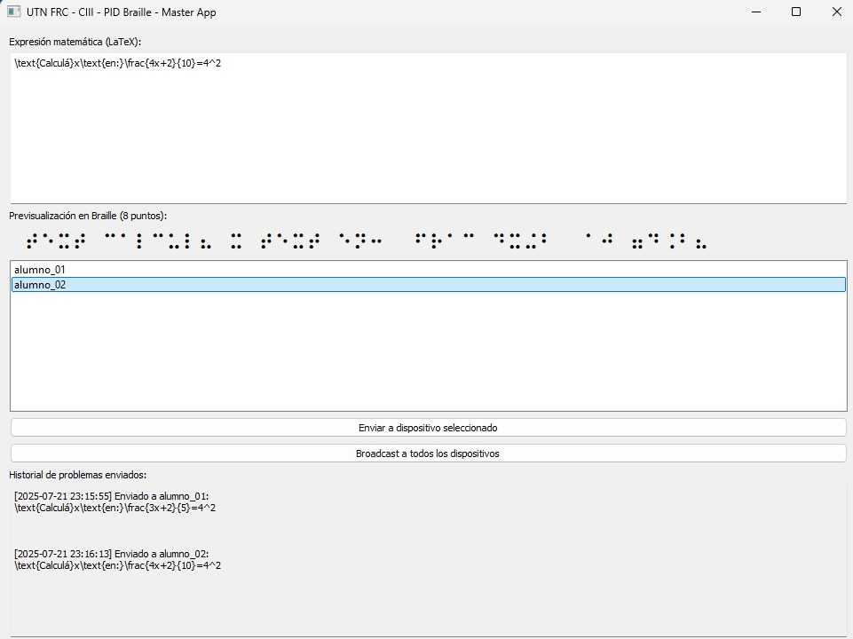
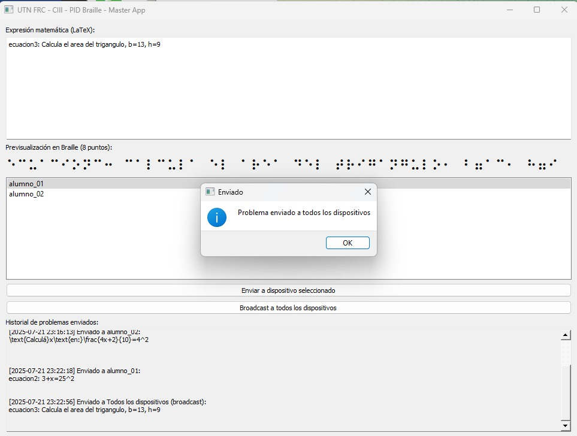
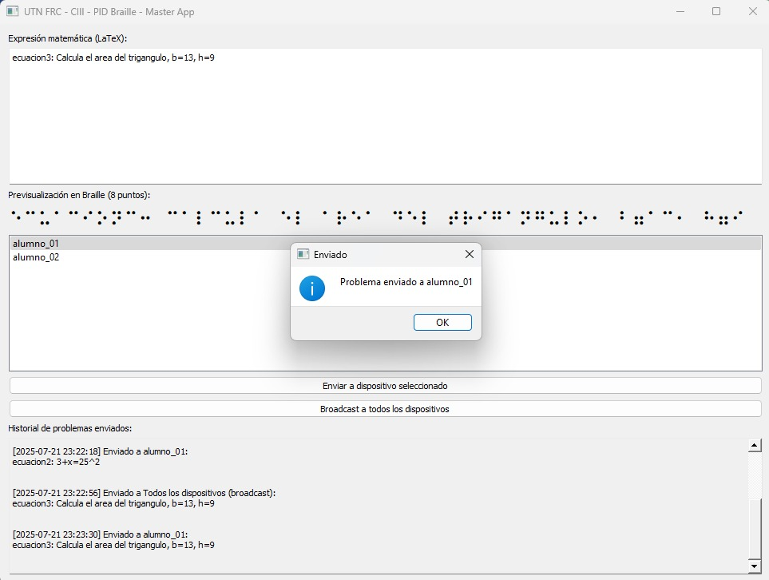

# Braille MQTT Classroom

**Braille MQTT Classroom** es una herramienta educativa desarrollada por el centro PID BRAILLE (UTN FRC) para facilitar la inclusión en la enseñanza de matemáticas. Permite enviar problemas matemáticos desde una PC a dispositivos Braille basados en ESP32 a través de MQTT.

La aplicación cuenta con una interfaz de escritorio desarrollada en PyQt5, la cual permite a los docentes:

- Escribir expresiones matemáticas en LaTeX.
- Convertir las expresiones a Braille de 8 puntos.
- Visualizar la expresión en formato LaTeX renderizado.
- Elegir uno o más dispositivos conectados para enviar los problemas.
- Hacer envíos en broadcast.
- Ver un historial de problemas enviados.

---

## 🧠 Características

- 🌐 Comunicación mediante servidor MQTT local (Mosquitto).
- 🧑‍🏫 Envío individual o grupal (broadcast) a dispositivos ESP32.
- 🔡 Conversión de expresiones matemáticas de LaTeX a Braille Unicode (8 puntos).
- 🖼 Visualización en LaTeX y Braille.
- 🧾 Historial de envíos.

---

## 📸 Capturas de pantalla

### Interfaz principal



### Visualización de Braille



### Historial de problemas enviados



---

## 🚀 Requisitos

- Python 3.10+
- Mosquitto MQTT Broker (instalación local)
- ESP32 con firmware compatible

## 📦 Instalación

```bash
git clone https://github.com/facundoolmedo/braille-mqtt-classroom.git
cd braille-mqtt-classroom
python -m venv .venv
.venv\Scripts\activate
pip install -r requirements.txt
```

## ▶️ Ejecución

```bash
python master_app.py
```

---

## 🔧 Desarrollo de hardware

En paralelo, el equipo del centro está desarrollando los dispositivos físicos basados en ESP32 con displays Braille (LEDs) para que los estudiantes puedan recibir y visualizar las expresiones en tiempo real.

---

## 🏫 Sobre el proyecto

Este desarrollo forma parte de una iniciativa de investigación y desarrollo del **Centro de Investigación CIII** Proyecto PID BRAILLE perteneciente a la **Universidad Tecnológica Nacional - Facultad Regional Córdoba**.

---

¿Te gustaría colaborar con el hardware, software o pruebas educativas? ¡Contactanos o abrí un issue en el repositorio!

